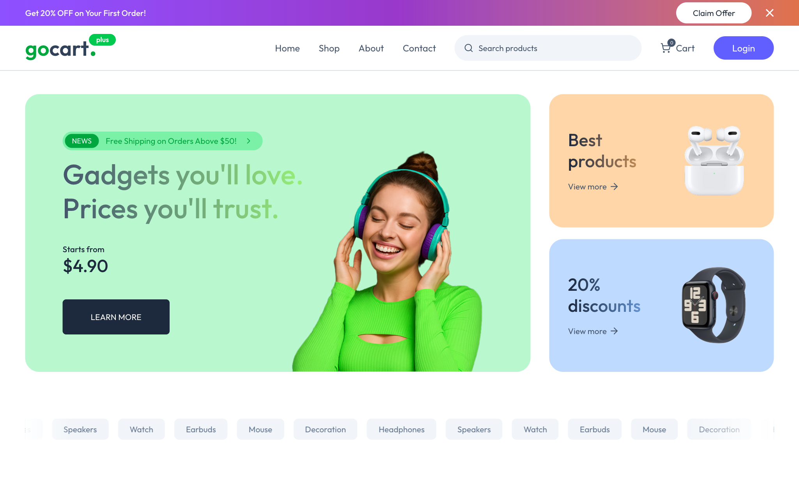
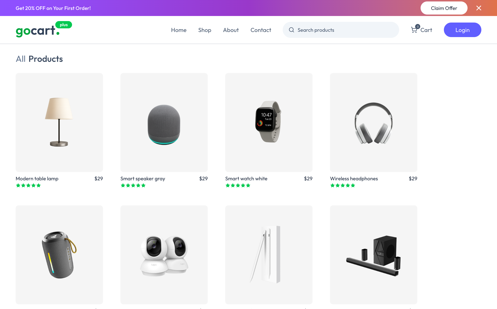
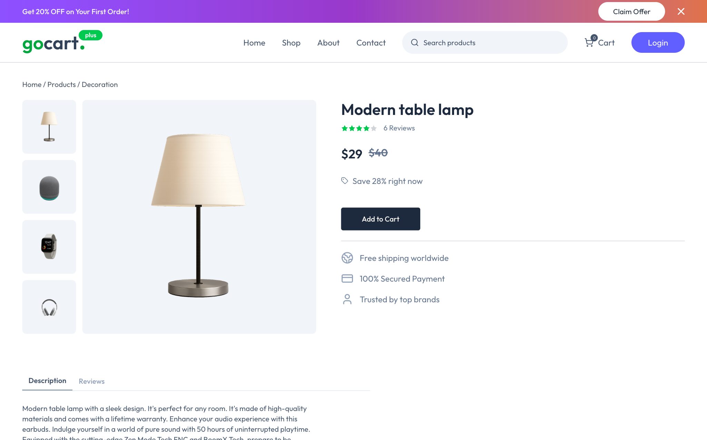
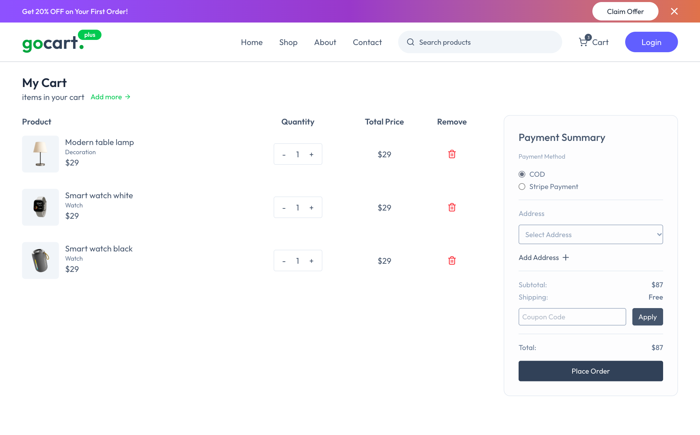
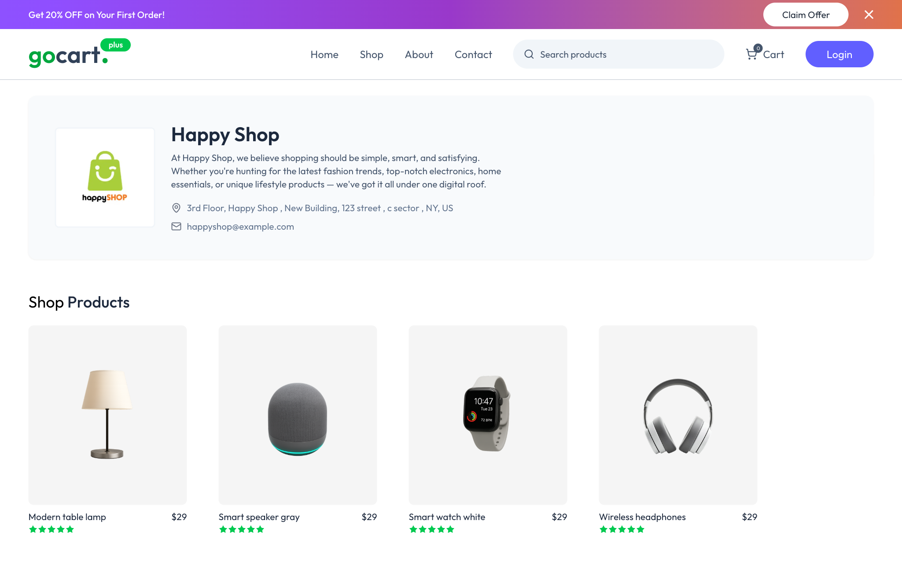
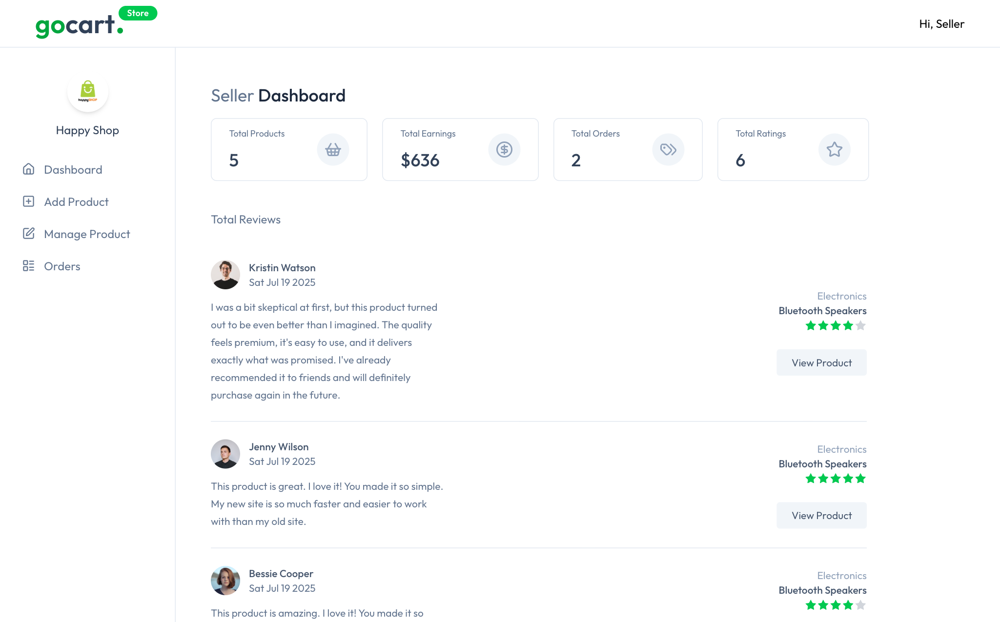
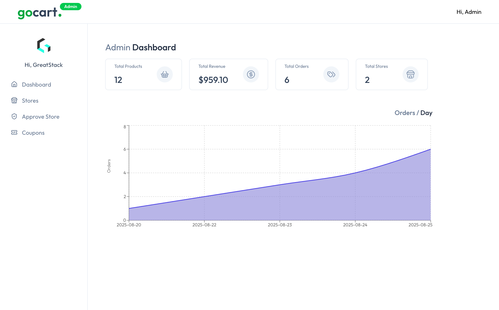

<div align="center">

# GoCart — Multi-Vendor E-Commerce Platform

**A multi-vendor marketplace storefront with seller and admin dashboards, built with Next.js 15, Redux Toolkit and Tailwind CSS.**

[](https://khushal-narsaria.github.io/GoCart-Fullstack-E-Commerce-Website/)


[](LICENSE.md)

</div>

<!-- live-links -->
> 🔗 **Live demo:** [khushal-narsaria.github.io/GoCart-Fullstack-E-Commerce-Website](https://khushal-narsaria.github.io/GoCart-Fullstack-E-Commerce-Website/)  
> 👤 **Portfolio:** [khushal-narsaria.github.io](https://khushal-narsaria.github.io/)  
<!-- live-links -->



## Features

**Storefront**
- Home page with hero banners, category marquee, latest and best-selling products
- Shop page with search (`/shop?search=`), product cards, ratings and discounts
- Product detail pages with image gallery, description and reviews tabs, and a link to the seller's store
- Cart with quantity controls, payment-method choice (COD / Stripe), saved addresses and coupon field
  (the cart is kept in Redux and persisted to `localStorage`, so it survives reloads)
- Order history and pricing (seller plans) pages

**Seller dashboard (`/store`)**
- Earnings, orders, products and ratings overview with recent reviews
- Add and manage products, view and update store orders

**Admin dashboard (`/admin`)**
- Platform totals (products, revenue, orders, stores) and an orders-per-day chart (Recharts)
- Store list, store approval queue and coupon management

## Screenshots

| Shop | Product page |
|---|---|
|  |  |

| Cart & checkout | Store page |
|---|---|
|  |  |

| Seller dashboard | Admin dashboard |
|---|---|
|  |  |

## Tech stack

| Area | Technologies |
|---|---|
| Framework | Next.js 15 (App Router, static export), React 19 |
| State | Redux Toolkit slices: cart, products, addresses, ratings |
| Styling | Tailwind CSS 4, Lucide icons |
| Charts & UX | Recharts, react-hot-toast, date-fns |
| Data model | Prisma schema (`prisma/schema.prisma`): users, stores, products, orders, ratings, addresses, coupons |
| Hosting | GitHub Pages via GitHub Actions |

> **Data:** the app currently runs on the sample catalogue in `assets/assets.js` (products, stores, orders, ratings). The Prisma schema defines the database model for connecting a PostgreSQL backend.

## Getting started

```bash
git clone https://github.com/Khushal-Narsaria/GoCart-Fullstack-E-Commerce-Website.git
cd GoCart-Fullstack-E-Commerce-Website
npm install
npm run dev        # http://localhost:3000
```

Production build (static export to `out/`):

```bash
npm run build
```

For a sub-path deployment (as on GitHub Pages), set `NEXT_PUBLIC_BASE_PATH=/GoCart-Fullstack-E-Commerce-Website` before building. `.github/workflows/deploy.yml` does this automatically on every push.

## Project structure

```
app/(public)/     storefront: home, shop, product/[productId], shop/[username], cart, orders, pricing
app/store/        seller dashboard: overview, add-product, manage-product, orders
app/admin/        admin dashboard: overview, stores, approve, coupons
components/       UI components (Navbar, ProductCard, OrderSummary, charts, …)
lib/features/     Redux Toolkit slices (cart, product, address, rating)
prisma/           database schema
assets/           product images and sample data
```

## Credits

Built on the open-source [GoCart](https://github.com/GreatStackDev/goCart) template by GreatStack (MIT License), extended with static-export deployment, pre-rendered product/store routes and a persistent cart.

## Author

**Khushal Narsaria** · [Portfolio](https://khushal-narsaria.github.io/) · [LinkedIn](https://www.linkedin.com/in/khushal-narsaria/) · [GitHub](https://github.com/Khushal-Narsaria)
